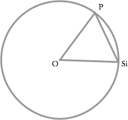

# 球面定位算法
##问题描述
假设有 N 个传感器，第 i 个传感器坐标为$(R,\alpha ,\beta ,\gamma )$。其中 $R$ 是球面的半径，$\alpha ,\beta ,\gamma$分别是传感器坐标向量与$x_i,y_i,z_i$轴所成的角度。

对于一个声发射源，第 i 个传感器测得的到达时间为$t_i$。

声速为 v。

求声发射源的位置$(x,y,z)$。

##求解过程
作一个过声发射源点 P 、第 i 个传感器 $S_i$ 的球上大圆，如图。

弧长$PS_i$就是声波走过的距离$vt_i$，弦长$PS_i$是两个坐标的直线距离$\sqrt{(x-x_i)^2+(y-y_i)^2+(z-z_i)^2}$。

根据圆内角的关系，可以得到，对于第 i 个传感器，满足
$$
\sqrt{(x-x_i)^2+(y-y_i)^2+(z-z_i)^2}/2R=\sin(vt_i/2R)
$$

声发射源和传感器坐标都是球面上的点，满足约束条件
$$
x^2+y^2+z^2=R^2
$$

可以化简为
$$
2x_ix+2y_iy+2z_iz=4R^2\sin^2(vt_i/2R)-2R^2
$$

令$b_i=4R^2\sin^2(vt_i/2R)-2R^2$

又有球面坐标的关系
$$
x_i = R\cos \alpha \\
y_i = R\cos \beta \\
z_i = R\cos \gamma
$$

即求解
$$
Ax=b
$$

其中
$$
A = \left[
\begin{array}{ccc}
2x_1 & 2y_1 & 2z_1 \\
2x_2 & 2y_2 & 2z_2 \\
\vdots & \vdots & \vdots \\
2x_n & 2y_n & 2z_n \\
\end{array} \right]
$$

$$
b=\left[
\begin{array}{c}
b_1 \\
b_2 \\
\vdots \\
b_n
\end{array} \right]
$$

则
$$
x= (A^TA)^{-1}A^Tb
$$

